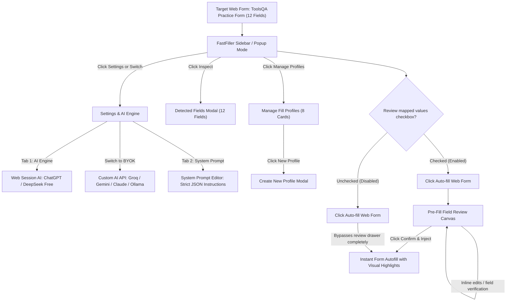

# FastFiller UI & Architecture Specification (100% Screenshot Verified)

This document establishes the verified UI structure, element hierarchy, visual tokens, and state transition workflows for **FastFiller**, derived directly from the 14 real extension screenshots in `Screenshot/`.

---

## 1. Interaction Flow & State Machine

---

## 2. Verified Screenshot Inventory

| Screenshot File | Screen / Component | Key UI Elements & Visual Details |
|---|---|---|
| `01_sidebar_dark_profile.png` | **Main Sidebar (Dark Theme)** | Logo `FastFiller` + `SIDEBAR` badge, Header icons (`☼`, `◫`, `?`, `⚙`), Engine pill (`• Web Session AI · ChatGPT Web` + `Switch ▾`), Detection banner (`◎ 1 field detected · Inspect`), Profile selector (`Demo ▾` + `Manage Profiles`), Bio Data textarea (`~78 tokens (311 chars) ✓ Saved`), Unchecked review box (`[ ]`), Gradient button `⚡ Auto-fill Web Form`, Footer shortcut `Ctrl + Enter`. |
| `02_settings_websession_chatgpt.png` | **Settings (Web Session AI)** | Header `← Settings & AI Engine` `v1.0.0`, Tabs (`AI Engine` active, `System Prompt`), Engine Mode Cards (`Web Session AI` [ACTIVE] vs `Custom AI API`), Selected engine `◉ ChatGPT Web` vs `○ DeepSeek Web`, Sub-card explanation (Zero-Key, No API Key, 100% Private), `Check ChatGPT Web Status` button. |
| `03_settings_custom_api_groq.png` | **Settings (Custom AI API)** | Active BYOK view: Provider `Groq — Ultra Fast · Free Dev Tier` (`Ultra Fast ~300ms`), API key masked input `•••••••` with toggle eye, Model `qwen/qwen3.8-27b` with `Free Only (4)` toggle and `↻ Fetch Models`, `Ping API & Check Latency` button. |
| `04_settings_provider_dropdown.png` | **Settings (Provider Dropdown)** | Expanded dropdown: Groq, OpenRouter (200+ models), Gemini 3.5 Flash-Lite, OpenAI (GPT-4o Mini / o3-mini), Anthropic (Claude 3.5 / 3.7 Sonnet), DeepSeek (V3 / R1), NVIDIA NIM, Meta Together AI, Ollama (Local), OpenCode Free, Custom (BYOK). |
| `05_settings_system_prompt.png` | **Settings (System Prompt Tab)** | `System Instructions` `Default` badge, `1896 chars`, `Reset to Default`. Monospace prompt enforcing raw JSON output `{"<field_class>": "<value>"}`, strict data fidelity, fake/demo data directives, radio/checkbox controls. |
| `06_detected_fields_modal.png` | **Detected Fields Modal** | Pop-up overlay: `Detected Fields (12)` with `✕` close. Lists 12 fields with row number, exact label, and type badge (`text`, `radio`, `select`, `checkbox`, `textarea`). |
| `07_sidebar_review_checkbox_checked.png` | **Main Sidebar (Review Mode Enabled)** | Same as 01, but: Detection banner shows `◎ 12 fields detected · Inspect`, and crucially the checkbox `[✓] Review mapped values before injecting into webpage` is **CHECKED** (vibrant purple checkbox with white check). |
| `08_settings_websession_hires.png` | **Settings (Web Session High-Res)** | High-resolution capture of zero-key Web Session mode with ChatGPT Web selected. |
| `09_web_practice_form_target.png` | **Live Form Autofill in Action (ToolsQA Practice Form)** | Full webpage layout side-by-side with FastFiller showing all 12 fields populated with React-Select multi-chips, radio buttons, checkboxes, cascading dropdowns, and the 'Filled 12 fields in 9.7s via Web Session AI' success banner with 1-Click Undo. |
| `10_settings_custom_api_hires.png` | **Settings (Custom API High-Res)** | High-resolution capture of Groq fast BYOK configuration. |
| `11_prefill_field_review_drawer.png` | **Pre-Fill Field Review Canvas** | Header `✓ Pre-Fill Field Review (12 of 12 selected)` with `⤢` expand and `✕` close. Subheader `Uncheck any fields you wish to skip.` + `Deselect All`. 12 mapped field cards with editable inputs, and sticky bottom footer with `Cancel` and gradient button `✓ Confirm & Inject (12)`. |
| `12_manage_fill_profiles.png` | **Manage Fill Profiles View** | Header `📁 Manage Fill Profiles (8)`. Search bar. 8 profile cards: Job Application (Career), Personal & Contact (Personal), Shipping & Checkout (Orders), Demo (Active, magenta border), demo 2, Untitled, moye moye. Footer with `Export`, `Import`, `Reset Defaults`, and `+ New Profile` button. |
| `13_create_new_profile_modal.png` | **Create New Profile Modal** | Modal overlay: `Create New Profile`. Subtext `Give your profile a clear name...`. Input `Profile name...`. Radio choices: empty profile, copy current profile, import from file (.txt, .md, .json). `Cancel` and `Create Profile` buttons. |
| `14_sidebar_light_mode.png` | **Sidebar (Light Theme)** | Full light mode variation: Crisp white `#ffffff` background, slate borders, dark text, dark moon icon `☾`, active gradient button and purple checkbox. |

---

## 3. The Core Dual-Workflow Mechanism

The user emphasized this critical UX distinction:

### Pathway 1: Review & Human Verification (`Review mapped values` = CHECKED [✓])
1. User clicks `⚡ Auto-fill Web Form`.
2. Extension opens **`Pre-Fill Field Review` canvas** (`11_prefill_field_review_drawer.png`).
3. All 12 detected fields are displayed with AI-mapped values pre-filled in editable inputs.
4. User can inspect, uncheck fields they don't want filled, or directly edit text (e.g. modify current address or fix a typo).
5. User clicks `✓ Confirm & Inject (12)`.
6. Values are injected into the webpage with emerald/teal field glow animations.

### Pathway 2: Turbo 1-Click Injection (`Review mapped values` = UNCHECKED [ ])
1. User unchecks `Review mapped values before injecting into webpage`.
2. User clicks `⚡ Auto-fill Web Form`.
3. Extension skips the review canvas completely and immediately injects mapped values directly into the target webpage in <300ms!

---

## 4. Design System Tokens (100% Match)

- **Dark Surface Background**: `#0b0f19` (Sidebar), `#0e1626` (Cards/Panels), `#131d31` (Input fields)
- **Borders**: `#1e293b` (Subtle), `#334155` (Hover), `#ec4899` / `#f97316` (Active accents)
- **Primary CTA Gradient**: `linear-gradient(135deg, #f97316 0%, #d946ef 50%, #8b5cf6 100%)`
- **Active Pill Badge**: `#ec4899` (Magenta/Pink `ACTIVE` pill)
- **Accent Teal (Field Detection)**: `#06b6d4` / `#14b8a6` (`◎ 12 fields detected · Inspect`)
- **Typography**: Inter / system sans-serif for UI; Monospace (`Fira Code`, `JetBrains Mono`) for token counts and System Prompt textarea.
