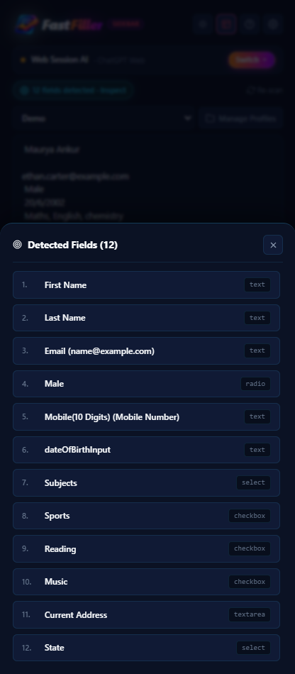
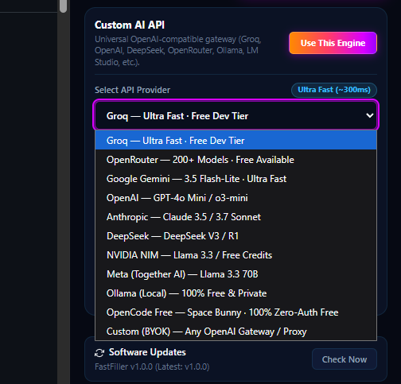
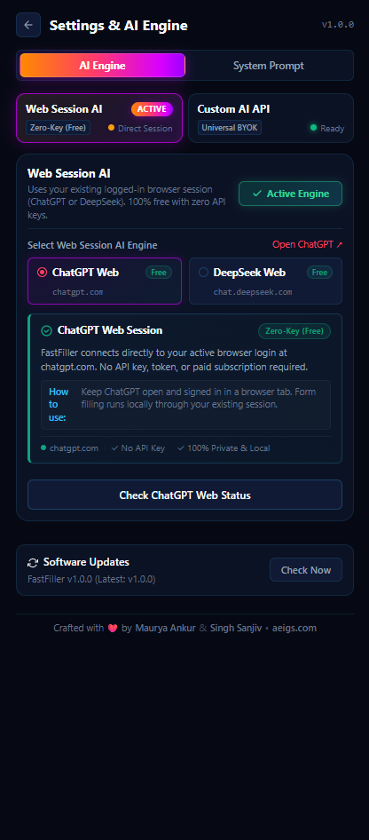
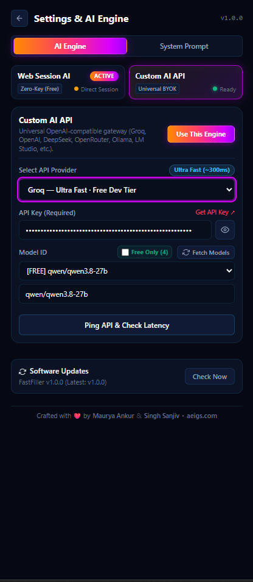
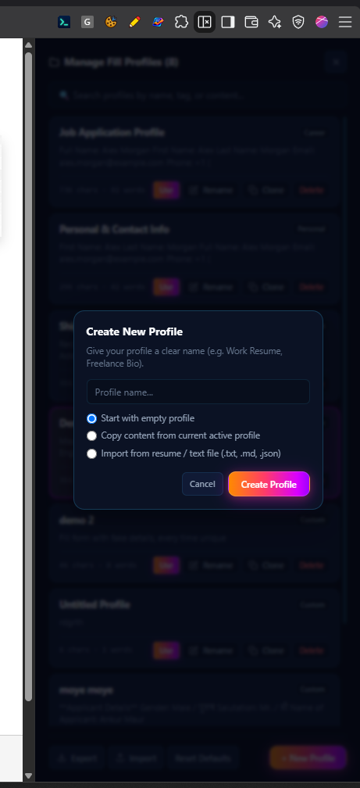
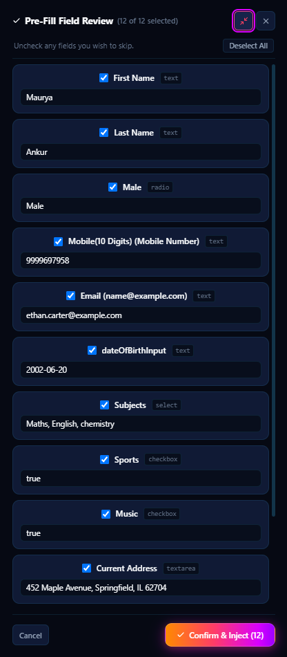
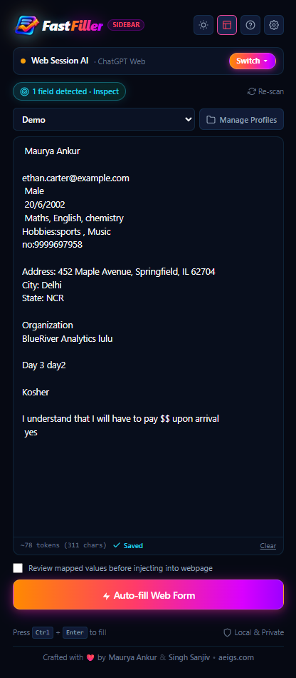
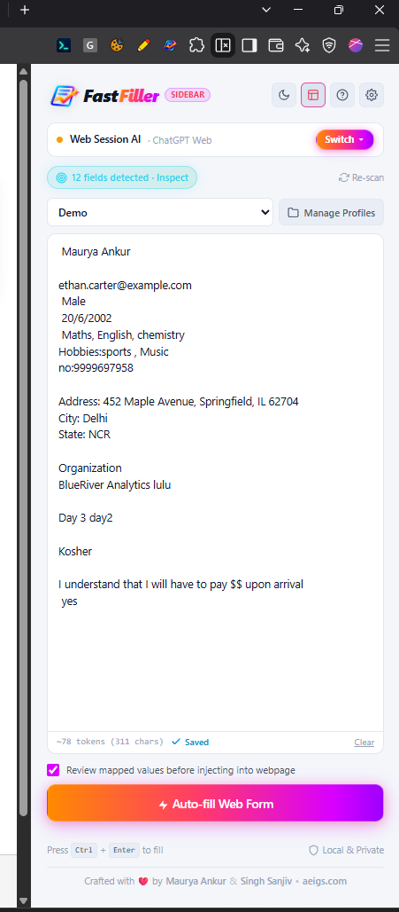

# FastFiller — Feature Specification & Technical User Guide

[](https://github.com/mauryaankur99/FastFiller/releases)
[](manifest.json)
[](#13-privacy-security--technical-architecture)
[](LICENSE)

> **FastFiller** is an open-source, client-first browser extension engineered for automated web form discovery, contextual AI reasoning, and direct DOM injection. This document serves as the comprehensive technical reference and user guide detailing every module, DOM compatibility layer, synthetic event pipeline, and configuration option.

---

## 📑 Table of Contents

- [Architectural Overview & Lifecycle](#-architectural-overview--lifecycle)
- [Module 1: Core Form Autofill Engine](#1--core-form-autofill-engine)
- [Module 2: Form Field Detection & DOM Compatibility](#2--form-field-detection--dom-compatibility)
- [Module 3: Advanced Form Controls & Synthetic Events](#3--advanced-form-controls--synthetic-events)
- [Module 4: Sensitive Field & Peripheral Protection](#4--sensitive-field--peripheral-protection)
- [Module 5: Multi-Tier AI Provider Ecosystem](#5--multi-tier-ai-provider-ecosystem)
- [Module 6: Model Management & Latency Diagnostics](#6--model-management--latency-diagnostics)
- [Module 7: Profile & Template Management System](#7--profile--template-management-system)
- [Module 8: Pre-Fill Dry-Run & Staging Inspector](#8--pre-fill-dry-run--staging-inspector)
- [Module 9: Reversible Fills & Safety Controls](#9--reversible-fills--safety-controls)
- [Module 10: Semantic Mapping Intelligence & Multilingual Handling](#10--semantic-mapping-intelligence--multilingual-handling)
- [Module 11: Large Form Optimization & Background Execution](#11--large-form-optimization--background-execution)
- [Module 12: User Interface, Themes & Productivity](#12--user-interface-themes--productivity)
- [Module 13: Privacy, Security & Technical Architecture](#13--privacy-security--technical-architecture)

---

## 🔄 Architectural Overview & Lifecycle

When a user initiates an autofill action via the extension popup, sidebar, or keyboard shortcut, FastFiller executes a deterministic 6-stage pipeline:

```text
┌─────────────────┐     ┌──────────────────────┐     ┌──────────────────────┐
│  1. DOM Scan    │ ──> │ 2. Context Extraction│ ──> │ 3. Multi-Tier AI     │
│  All inputs,    │     │ Resolve labels, ARIA,│     │ Semantic mapping via │
│  shadow roots   │     │ sections & types     │     │ Web Session or BYOK  │
└─────────────────┘     └──────────────────────┘     └──────────────────────┘
                                                                │
                                                                ▼
┌─────────────────┐     ┌──────────────────────┐     ┌──────────────────────┐
│ 6. 1-Click Undo │ <── │ 5. Synthetic Events  │ <── │ 4. Staged Review     │
│ Revert all DOM  │     │ Dispatch input, change│     │ Optional Dry-Run     │
│ states cleanly  │     │ & framework triggers │     │ granular inspection  │
└─────────────────┘     └──────────────────────┘     └──────────────────────┘
```

---

## 1. 🎯 Core Form Autofill Engine

* **One-Click Automated Execution:** A single primary action (`Auto-fill Web Form`) triggers element discovery, context extraction, AI mapping, and value injection in sub-seconds.
* **Semantic LLM Mapping:** Maps user profile data to target inputs based on semantic meaning rather than fragile field names, hardcoded IDs, or brittle regular expressions.
* **Profile-Driven Population:** Select from multiple saved profiles (e.g., *Job Application*, *Contact Info*, *Checkout Address*) to instantly adapt filling behavior to the form's context.
* **Arbitrary Raw Text Input:** Paste resumes, cover letters, raw bios, or specific instructions directly into the extension textarea for immediate on-the-fly parsing.
* **Direct DOM Value Injection:** Updates input values, radio choices, select options, and custom checkboxes directly in the active webpage DOM.
* **Strict Submission Safety:** Exclusively automates field entry; FastFiller never clicks "Submit", never triggers financial transactions, and never attempts to bypass human verification checks.

---

## 2. 🔍 Form Field Detection & DOM Compatibility

FastFiller implements an exhaustive element scanner capable of interacting with standard HTML5 elements, custom Web Components, and modern component libraries:

<p align="center">
  
</p>

### Supported Control Types
* Standard text inputs (`text`, `email`, `tel`, `url`, `number`, `search`)
* Multi-line textareas (`<textarea>`)
* Native select dropdowns (`<select>`)
* Radio buttons & radio groups (`input[type="radio"]`)
* Standard checkboxes & checkbox groups (`input[type="checkbox"]`)
* ARIA custom checkboxes (`[role="checkbox"]`)
* ARIA custom radio buttons (`[role="radio"]`)
* ARIA custom listboxes (`[role="listbox"]`)
* ARIA custom comboboxes (`[role="combobox"]`)
* **React-Select** single-select and multi-select chip containers
* Contenteditable elements (`[contenteditable="true"]`)
* HTML5 date pickers and specialized date inputs

### Detection & Label Heuristics
* **Multi-Tier Label Resolution:** Resolves field labels through 7 sequential heuristics:
  1. `aria-labelledby` reference resolution
  2. Direct `aria-label` attribute
  3. Associated `<label for="...">` elements
  4. Wrapping parent `<label>` tags
  5. Enclosing form-group / container headers
  6. Surrounding `<legend>` text in `<fieldset>` blocks
  7. Element `placeholder` and `title` fallbacks
* **Surrounding Section Context:** Detects parent heading hierarchy (e.g., *Personal Details*, *Emergency Contact*, *Work Experience*) to provide vital disambiguation context to the AI model.
* **Required Field Recognition:** Flags required fields using HTML `required`, `aria-required="true"`, and standard asterisk CSS classes.
* **Deep Shadow DOM Traversal:** Recursively penetrates open Shadow Roots (`element.shadowRoot`) to discover encapsulated inputs within custom Web Components.
* **7-Tier Resilient Field Lookup:** Locates target elements on injection using internal tracking IDs, native IDs, names, normalized classes, hierarchical DOM coordinates, label text, and Shadow Root references.
* **Two-Way Element Highlighting:** Clicking or hovering any field in the Detected Fields Drawer draws a physical highlight on the target element in the webpage.
* **Visual Confirmation Pulses:** Filled elements receive a temporary soft green pulse confirming injection.
* **Dynamic Re-Scanning:** Manual `Re-scan` button for dynamic single-page applications (SPAs), plus automated scans on tab switches and navigation events.

---

## 3. 🎛️ Advanced Form Controls & Synthetic Events

Modern reactive web frameworks (React, Vue, Angular, Svelte) maintain internal state separate from the raw DOM. FastFiller dispatches complete synthetic event sequences to ensure state synchrony:

* **React-Select Single-Select:** Interacts with React-Select wrappers, activates the input container, types search queries, and selects matching options from the portal menu.
* **React-Select Multi-Select Chips:** Sequentially searches and commits multiple selection chips/tags without dropping preceding selections.
* **ARIA Custom Dropdowns & Menus:** Triggers `aria-expanded` toggles, traverses listbox options, and simulates selection events.
* **Cascading Dropdowns:** Handles parent-child dependencies (e.g., *Country → State → City*) by sequencing selections cleanly.
* **Date Normalization:** Intelligently formats raw birthdates or event dates to match the input's format requirement (`YYYY-MM-DD`, `MM/DD/YYYY`, or verbal formats).
* **Framework Synthetic Event Dispatch:** For every injected element, FastFiller dispatches a full native event sequence:
  ```javascript
  ['mousedown', 'focus', 'keydown', 'input', 'change', 'blur'].forEach(eventType => {
    element.dispatchEvent(new Event(eventType, { bubbles: true, cancelable: true }));
  });
  ```

---

## 4. 🛡️ Sensitive Field & Peripheral Protection

FastFiller protects personal security and page integrity by automatically filtering out unauthorized or high-risk inputs:

* **Automatic Sensitive Field Exclusion:** Automatically detects and skips:
  * Passwords and password confirmation inputs (`type="password"`, `name*="pass"`)
  * Credit card / debit card numbers (`autocomplete="cc-number"`, `name*="card"`)
  * CVV / CVC verification codes
  * Social Security Numbers (SSN)
  * Banking / Payment PIN codes
* **Anti-Bot & CAPTCHA Exclusion:** Detects and ignores verification widgets, including Google reCAPTCHA, Cloudflare Turnstile, hCaptcha, and math puzzles.
* **Peripheral Widget Filtering:** Ignores non-form page elements such as live chat widgets (Intercom, Zendesk, Drift), search headers, and footer newsletter inputs.

---

## 5. 🤖 Multi-Tier AI Provider Ecosystem

FastFiller provides complete freedom of inference—from zero-cost browser sessions to ultra-fast cloud APIs and air-gapped local instances:

<p align="center">
  
</p>

### 5.1 Web Session AI (100% Free · Zero API Keys Needed)
FastFiller can bridge directly to an active browser tab session, allowing you to use premium web models without paying for API tokens or managing keys:

<p align="center">
  
</p>

* **ChatGPT Web Session:** Bridges with an active `chatgpt.com` tab session. Uses your logged-in session locally with zero API charges.
* **DeepSeek Web Session:** Bridges with an active `chat.deepseek.com` tab session for deep reasoning with zero setup.
* **Live Session Health Check:** One-click `Check Web Status` utility confirms that your tab session is active and authenticated before running a fill.

### 5.2 Universal BYOK & Cloud API Gateways
Connect any commercial or open-source inference endpoint:

<p align="center">
  
</p>

1. **Groq (Free Developer Tier):** Ultra-fast cloud inference (~300ms) with a generous free developer tier (`llama-3.3-70b-versatile`, `llama-3.1-8b-instant`).
2. **Google Gemini (Free Tier Available):** Google AI Studio integration supporting `gemini-3.5-flash-lite` and `gemini-3.5-flash` with daily free quota limits and zero subscription fees.
3. **OpenRouter (Free Models Available):** Unified gateway providing 200+ models, including 19+ permanently free models tagged `:free` (e.g., Llama 3.3 70B, DeepSeek R1, Mistral 7B).
4. **Local Ollama (100% Offline, Air-Gapped & Secure):** Connects to `http://localhost:11434/v1` for 100% local open weights (Llama 3, Mistral, Qwen, DeepSeek). Zero data leaves your machine—the ideal choice for strictly confidential, air-gapped, or enterprise environments.
5. **OpenCode Free (Zero-Auth / No API Key Required):** Pre-configured out of the box with zero setup, zero authentication, and zero keys required for the `space-bunny-free` model.
6. **Commercial AI APIs:** Direct integrations with OpenAI (`gpt-4o-mini`, `gpt-4o`), Anthropic (`claude-3-5-sonnet-latest`), DeepSeek (`deepseek-chat`, `deepseek-reasoner`), NVIDIA NIM, and Meta/Together AI.
7. **Custom BYOK Gateway:** Add any custom OpenAI-compatible endpoint URL, API key, and model identifier to connect LM Studio, vLLM, private self-hosted servers, or corporate proxies.

> [!NOTE]
> **Understanding Inference Speed & Latency:**
> - **Zero-Key Web Sessions (ChatGPT / DeepSeek Web):** Takes `~8–10s` (as shown in the live demonstration: `9.7s`) because the extension coordinates through an active browser tab session without consuming API credits or requiring developer accounts.
> - **Direct Fast Cloud APIs (Groq, Gemini 3.5 Flash-Lite, OpenRouter):** Completes in **sub-second to 1–2 seconds maximum** (Groq cloud inference runs at ~300ms). Direct HTTP REST streaming eliminates browser tab synchronization overhead for near-instant form completion.

---

## 6. 📊 Model Management & Latency Diagnostics

* **Dynamic Model Discovery:** The `Fetch Models` button queries the provider's `/models` endpoint to populate live model options.
* **Free-Only Filter:** A one-click `Free Only` toggle filters out paid commercial models to display only free-tier options.
* **Chat Model Filtering:** Automatically filters out embeddings, TTS, audio, and image models to prevent configuration mistakes.
* **Offline Fallback Registry:** Built-in model presets ensure the extension works reliably even if a provider's model listing endpoint is unreachable.
* **Live Latency & Ping Diagnostic:** The `Ping API & Check Latency` utility sends a test handshake and reports the round-trip network response time in milliseconds.
* **Active Status Pill:** The main header displays the active provider, model name, and connection status in real-time.

---

## 7. 👤 Profile & Template Management System

Manage multiple identities, resumes, and data sets for different contexts:

<p align="center">
  
</p>

* **Multi-Profile Storage:** Create distinct profiles for *Job Applications*, *Personal Contact Info*, *E-Commerce Shipping*, or *Corporate Billing*.
* **Instant Profile Switching:** Select profiles instantly from the primary dropdown on the main screen.
* **Full-Text Profile Search:** Filter profiles by name, tag, or content inside the Profile Manager.
* **Creation Modalities:**
  * Start with an empty blank template
  * Duplicate the currently active profile
  * Import from a resume or text file (`.txt`, `.md`, `.json`)
* **Backup & Migration:**
  * **JSON Export:** Download all profiles and preferences as a date-stamped backup file.
  * **JSON Import:** Restore profiles from a previous backup file.
  * **Reset to Defaults:** Restore original starter templates with an automated safety backup created before resetting.
* **Integrated Multiline Editor:** In-place profile editor with auto-save, live character counter, and estimated token usage counter (`~X tokens`).

---

## 8. 👁️ Pre-Fill Dry-Run & Staging Inspector

For maximum control, FastFiller includes an optional dry-run review mode that pauses execution before any value is injected into the webpage:

<p align="center">
  
</p>

* **Review Toggle:** Enable `Review mapped values before injecting into webpage` in the main view.
* **Visual Value Preview:** Displays all mapped values alongside detected field labels and types.
* **Granular Field Checkboxes:** Uncheck any field you wish to skip prior to injection.
* **In-Place Value Editing:** Modify or correct any AI-suggested value directly inside the staging drawer.
* **Bulk Selection:** One-click `Select All` and `Deselect All` buttons for rapid adjustments.
* **Confirm & Inject:** Injects only the verified, selected values into the active webpage DOM.

---

## 9. ↩️ Reversible Fills & Safety Controls

* **1-Click Instant Undo:** Reverts all filled fields back to their exact pre-fill values without requiring a page reload.
* **Comprehensive DOM Snapshot:** FastFiller records a detailed state snapshot (values, checked states, selected indexes) immediately before injecting values.
* **In-Flight Cancellation:** During execution, the primary button transforms into `Stop Auto-fill`, allowing you to cancel active jobs immediately.
* **Skipped Fields Tracking:** Clear status reporting notes which fields were intentionally skipped or could not be mapped.

---

## 10. 🎯 Semantic Mapping Intelligence & Multilingual Handling

* **Strict Data Fidelity:** Default system prompts instruct the AI to preserve user-provided information without fabricating data.
* **Name Decomposition:** Intelligently splits full names when separate *First Name* and *Last Name* fields are present.
* **Phone Number Standardization:** Normalizes irregular phone formats and standardizes country/area codes.
* **Dropdown Semantic Matching:** Maps profile values to the closest valid option in select dropdowns.
* **Placeholder Value Avoidance:** Instructs the AI to ignore dummy placeholder choices (e.g., *Select*, *Choose...*, *-- None --*).
* **Multilingual Compound Labels:** Resolves dual-language and compound field labels (e.g., `Region / District`, `Full Name (English / Local)`).
* **Negative & Skip Directives:** Respects instructions like `skip`, `ignore`, `blank`, `leave blank`, or `do not fill` by intentionally leaving the target field empty rather than typing the directive word into the input.
* **Dynamic Template Variables:** Evaluates runtime dynamic variables embedded in profiles:
  * `{{today}}` (ISO Date: `YYYY-MM-DD`)
  * `{{today_us}}` (`MM/DD/YYYY`)
  * `{{today_formatted}}` (e.g., `October 6, 2026`)
  * `{{in_2_weeks}}` (Date offset by +14 days)
* **Synthetic / Mock Data Mode:** Generates realistic synthetic test data (e.g., sample names, `@example.com` emails) when prompted for dummy or mock testing.

---

## 11. 🚀 Large Form Optimization & Background Execution

* **Field Prioritization:** Prioritizes active/focused inputs, visible viewport elements, and required fields before processing off-screen DOM nodes.
* **Chunked Batch Processing:** Automatically divides large forms into manageable batches (~45 fields per request) to prevent AI token exhaustion and network timeouts.
* **Granular Progress Reporting:** Real-time progress updates (`Scanning...`, `Mapping Batch X of Y...`, `Injecting...`).
* **Manifest V3 Headless Service Worker:** Execution runs inside Chrome's background service worker, allowing long-running jobs to continue even if you close the popup or switch tabs.
* **Job State Re-Hydration:** Re-opening the popup seamlessly reconnects to active background jobs and displays current progress.

---

## 12. 🖥️ User Interface, Themes & Productivity

<p align="center">
  
  &nbsp;&nbsp;
  
</p>

* **Flexible Interface Modes:** Switch seamlessly between **Popup Window** (compact dropdown from the extension icon) and **Chrome Side Panel** (persistent sidebar via `chrome.sidePanel` that stays open while scrolling).
* **Default View Setting:** Set either Popup or Side Panel as your preferred default view in Settings.
* **Dark & Light Mode:** Built-in theme switcher with theme persistence and dynamic icon updates.
* **Keyboard Shortcuts:**
  * `Alt + Shift + F`: Global shortcut to autofill the active webpage form with your active profile.
  * `Ctrl + Enter` / `Cmd + Enter`: Trigger autofill from within the extension interface.
  * `Esc`: Immediately cancel active autofill or dismiss open modal drawers.
* **Context Menu Integration:** Right-click context menus for rapid access:
  * *Fastfiller: Autofill with Active Template*
  * *Paste active template into field*
  * *Paste Full Name*
  * *Paste Email Address*
  * *Paste Phone Number*
  * *Paste Bio / Work Summary*
* **Custom System Prompt Editor:** View, edit, and reset internal AI system instructions with live character counting.
* **In-App Offline User Guide:** Built-in documentation accessible directly via the `?` icon.
* **Automated Software Update Checker:** Periodically checks for new GitHub releases in the background and displays an update banner with 1-click download links.
* **Internationalization (i18n):** Includes 15 built-in browser language packs (`_locales/`: Arabic, German, English, Spanish, Filipino, French, Indonesian, Italian, Japanese, Dutch, Portuguese, Russian, Swedish, Turkish, Vietnamese) ensuring store listings, extension titles, and descriptions match the user's browser language.

---

## 13. 🔒 Privacy, Security & Technical Architecture

* **Zero-Server Architecture:** FastFiller runs entirely client-side. There are no central proxy servers, no cloud databases, and no telemetry tracking user data.
* **Local Storage Exclusivity:** All profiles, custom prompts, and settings are stored locally in `chrome.storage.local`.
* **Direct Encrypted Transport:** AI requests route directly from the user's browser to the chosen AI provider or local localhost endpoint.
* **SHA3-512 Cryptographic Hashing:** Uses `js-sha3` for internal data integrity and configuration verification.
* **Automated Test Suite:** 13 automated test suites covering API providers, Google Forms, dropdown matching, session managers, dry-run staging, storage, and background worker persistence.

---

## 👥 Authors & Leadership

- **Maurya Ankur** — Co-Founder & Lead Engineer ([LinkedIn](https://www.linkedin.com/in/ankur-maurya1/))
- **Singh Sanjiv** — Co-Founder & Systems Architect ([LinkedIn](https://www.linkedin.com/in/sanjiv-singh/))
- **Organization**: [Aeigs](https://aeigs.com) — *AI Systems, Automation Engines & High-Craft Developer Tools*

## 📄 License

This project is licensed under the [MIT License](LICENSE).
