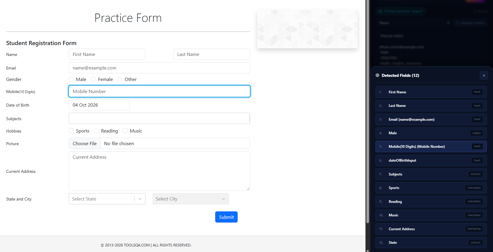

# FastFiller 🚀 — 1-Click AI Auto Form Filler

[](https://github.com/mauryaankur99/FastFiller/releases)
[](LICENSE)
[](manifest.json)
[](#-quick-installation-guide)
[](#-privacy--security-guarantee)
[](#-testing)

> **FastFiller** is an open-source, client-first browser extension that instantly maps and fills complex web forms using AI. Works across job portals (Workday, Greenhouse, Lever, Ashby, LinkedIn), Google Forms, government applications, registration portals, and custom corporate SPAs.

<p align="center">
  
</p>

> ⚡ **Speed & Performance Note:** The screenshot above demonstrates **Zero-Key Web Session AI** (`~9.7s` due to browser tab session bridge with zero API charges). When using direct fast cloud APIs like **Groq (~300ms)** or **Google Gemini 3.5 Flash-Lite**, form discovery, mapping, and DOM injection completes in just **1 to 2 seconds maximum**!

---

## 🌟 AI Model Architecture

FastFiller features a multi-tier engine architecture offering 100% flexibility—from zero-cost browser sessions to ultra-fast cloud APIs and air-gapped local privacy:

```text
FastFiller AI Model Architecture
├── 1. Web Session AI (100% Free · Zero API Keys Needed)
│   ├── ChatGPT Web (Direct active browser tab session)
│   └── DeepSeek Web (Direct web session bridge)
│
├── 2. Google AI Studio (Free-Tier API Available)
│   ├── Gemini 3.5 Flash Lite (Ultra-fast, lowest latency, generous daily free tier)
│   └── Gemini 3.5 Flash (Advanced reasoning & multi-step form mapping)
│
├── 3. Ultra-Fast Cloud & Developer Free Tiers
│   ├── Groq (Free Dev Tier · ~300ms ultra-fast Llama 3.3 70B & 8B)
│   ├── OpenRouter (19+ Free models tagged :free · Llama 3.3, Mistral, DeepSeek)
│   └── DeepSeek API (Direct high-speed deepseek-chat & deepseek-reasoner)
│
├── 4. Zero-Auth Free Model
│   └── Space Bunny via OpenCode (Zero setup, no API key or account required)
│
├── 5. 100% Offline, Air-Gapped & Secure (Zero Internet Required)
│   └── Local Ollama (Runs on localhost:11434 · Llama 3, Mistral, Qwen, DeepSeek)
│       └── 100% private & secure for confidential enterprise or personal data
│
└── 6. Custom BYOK Gateway (Universal OpenAI-Compatible)
    └── Any custom endpoint (LM Studio, vLLM, private servers, Claude, OpenAI)
```

---

## ⚡ Core Capabilities

* **🧠 Complex Form Intelligence:** Handles text, email, phone, textareas, native `<select>`, **React-Select** single & multi-chips, custom ARIA comboboxes, and Shadow DOM components with fuzzy matching.
* **🔄 Headless Background Worker:** Form filling runs persistently in Chrome's Service Worker—even if you close the popup or switch tabs.
* **↩️ 1-Click Instant Undo:** Snapshots initial DOM state before injection, allowing you to instantly revert any fill action with zero page reload.
* **📋 Profile & Template Manager:** Maintain multiple profiles (Job Applications, College Applications, Personal IDs) with dynamic runtime variables (`{{today}}`, `{{in_2_weeks}}`).
* **🌐 15 Built-in Languages:** Complete multi-locale architecture (`_locales/`) with intelligent multilingual and compound label matching.
* **🛡️ Zero-Knowledge Privacy:** 100% client-side execution. Sensitive fields (passwords, credit cards, CVVs, SSNs) and CAPTCHAs are automatically excluded.

<p align="center">
  
</p>

> 📖 **Looking for the exhaustive technical breakdown?**  
> Explore the complete [**Feature Specification & Technical User Guide**](FEATURES.md) for full DOM compatibility matrices, synthetic event lifecycles, and BYOK setup guides.

---

## 🚀 Quick Installation Guide

### Option A: Install from GitHub Releases (Recommended for Users)

1. Download **`FastFiller-v1.0.0.zip`** from the [Latest Releases](https://github.com/mauryaankur99/FastFiller/releases/latest).
2. Right-click the `.zip` file and extract it to a folder on your computer.
3. Open your Chromium-based browser and navigate to the Extensions page:
   - **Chrome**: `chrome://extensions`
   - **Brave**: `brave://extensions`
   - **Edge**: `edge://extensions`
4. Toggle **Developer mode** to **ON** (top right corner).
5. Click **Load unpacked** (top left corner) and select the extracted `FastFiller` folder (containing `manifest.json`).
6. Pin **FastFiller** 📌 to your browser toolbar for quick access!

---

### Option B: Clone from Source (For Developers)

```bash
# 1. Clone the repository
git clone https://github.com/mauryaankur99/FastFiller.git
cd FastFiller

# 2. Run test suites to verify integrity
npm test

# 3. Load unpacked in your browser
# Open chrome://extensions -> Developer Mode ON -> Load Unpacked -> select the FastFiller repo root.
```

---

## ⚡ How to Use

1. **Open Any Web Form:** Navigate to any form (job application, Google Form, registration portal).
2. **Open FastFiller:** Click the FastFiller icon in your toolbar, or press `Alt + Shift + F` on your keyboard.
3. **Select Your AI Engine:** In Settings (⚙️), choose **ChatGPT Web** or **DeepSeek Web** for zero-cost filling, or enter your API key for Gemini, Groq, OpenRouter, Claude, OpenAI, or local Ollama.
4. **Choose Your Profile:** Select a saved profile template or paste raw text/resume into the editor.
5. **Click "Auto-fill Web Form"** (or press `Ctrl + Enter`): FastFiller analyzes the form fields, requests the exact mapping from your selected AI engine, and populates the fields in sub-seconds.
6. **Review or Undo:** Inspect staged values before injection, or click **Undo** at any time to restore the initial form state.

---

## ⌨️ Keyboard Shortcuts

| Shortcut | Description |
| :--- | :--- |
| `Alt + Shift + F` | Trigger autofill directly on the active webpage using your active profile |
| `Ctrl + Enter` / `Cmd + Enter` | Start auto-fill when popup is focused |
| `Esc` | Stop active auto-fill immediately or close open drawers |

---

## 🛡️ Privacy & Security Guarantee

FastFiller is built from day one with a strict privacy-first, zero-knowledge architecture:

- **Zero FastFiller Servers:** Zero telemetry, zero intermediate proxies, and zero external databases. We do not track, collect, or monetize your activity.
- **Direct & Encrypted AI Dispatch:** Profile data, prompts, and form metadata go directly and encrypted (TLS/HTTPS) only to your chosen AI provider (OpenAI, Groq, Google, DeepSeek), or stay **100% local on your machine** when using **Local Ollama**.
- **Local Browser Storage:** All saved persona profiles, dynamic guidelines, and settings are strictly confined to your own device storage (`chrome.storage.local`).
- **Sensitive Field Guard:** FastFiller automatically detects and ignores credit card numbers, CVV codes, passwords, PIN codes, SSNs, and CAPTCHAs on web pages.

---

## 📂 Project Architecture

```
FastFiller/
├── manifest.json              # Chrome Extension Manifest V3 configuration
├── package.json               # Project metadata & test scripts
├── LICENSE                    # MIT License
├── AUTHORS.md                 # Core creators & leadership
├── CONTRIBUTING.md            # Guidelines for open-source contributors
├── SECURITY.md                # Security policy & disclosure protocols
├── README.md                  # Streamlined documentation & quickstart
├── FEATURES.md                # Feature Specification & Technical User Guide
├── _locales/                  # 15-language internationalization packages
├── Screenshot/                # High-resolution UI screenshots & architectural diagrams
├── assets/                    # Icons and branding stylesheets
├── src/
│   ├── background/            # Manifest V3 service worker & persistent job runner
│   ├── content/               # DOM form field scanner, injection engine & 1-click undo
│   ├── popup/                 # Main popup UI, settings view, templates & API providers
│   ├── services/              # Web-session managers (ChatGPT & DeepSeek), update checker
│   ├── sidepanel/             # Chrome side-panel persistent view
│   ├── help/                  # In-extension offline user guide
│   └── lib/                   # Cryptographic libraries (SHA3-512)
└── test/                      # 13 comprehensive unit & integration test suites
```

---

## 🧪 Testing

FastFiller includes 13 rigorous automated test suites covering DOM injection, dropdown matching, web session proof-of-work, background persistence, storage migrations, and update detection:

```bash
npm test
```

---

## 👥 Authors & Leadership

- **Maurya Ankur** — Co-Founder & Lead Engineer ([LinkedIn](https://www.linkedin.com/in/ankur-maurya1/))
- **Singh Sanjiv** — Co-Founder & Systems Architect ([LinkedIn](https://www.linkedin.com/in/sanjiv-singh/))
- **Organization**: [Aeigs](https://aeigs.com) — *AI Systems, Automation Engines & High-Craft Developer Tools*

---

## 📄 License

This project is licensed under the [MIT License](LICENSE).
